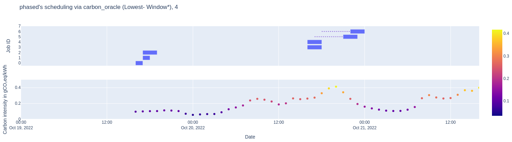

# 07.12.2023

## Maybe nochmal das aktuelle Verfahren fest definieren?

Nur paper tief lesen, die nah an meinem thema sind. zZ

eine surveys genau lesen die nach abstract am besten klingt. Sollte schon nach scheduling sein. scheduling parameter + jobs usw.

Bessere Organisation der paper, farbmarkierung? Notiz, warum das paper noch in der Liste ist.

+ Notizen immer offen haben dazu

## nächstes meeting absprechen und so

# 15.12.2023

## What did I do

+ weiter in der literatur recherche, eher noch auf einem abstract level
+ farbmarkierung für die einzelnen paper
+ some cool leads
  + job shop
  + gab 2019-ish schon paper (Green energy efficient scheduling management) was aber wenig sophisticated wirkt
  + wenig paper die auf strommix-level sind. Viele beschreiben eig. produktion
  + viel frequency / on / off scheduling, perhaps kann man das auch damit verbinden

## Fragen

+ was ist der usecase für die server des lehrstuhls (context being, dass man auch viel über VMs und so liest und deren scheduling / allocation)
  + traces des DHC labs bekommen und auswerten?
  + welche workload modelle gibt es so in der Literatur
  + welche utilization hat das DC
  + wie gut klappt aus / an auf den servern des DC?

## Next Steps

+ wenn extra bock: authoren der papers folgen, deren conferencen anschauen, connectedpapers.com
+ a* Konferenzen? oder thematische schmale / targeted workshop oder conference

+ *Energy efficient computing, clusters, grids and clouds: A taxonomy and survey* lesen und *Energy-Efficient Scheduling in Job Shop Manufacturing Systems: A Literature Review*
+ remember how to read a paper
+ ranking der anderen grünen papers, top3 lesen?
+ some kind of state of the art presentation thingy, was sind neue topics / deren annahmen / opportunities for a MA. gerne anhand von nem paper
  + welche methodik welche benchmarks welche metriken, das wäre auch für meine MA dann relevant
  + keine riesige vorbereitung, aber something ist bestimmt nice
+ weiter fragen aufschreiben!
+ also sooooon next step: wissen methodik, grobe fragestellung
+ mitte / ende januar auftaktpräsentation
  + da auch: was brauche ich, perhaps das schon früh lostreten.

is most published science wrong? <- youtube

# 09.01.24

## Next Steps

vllt. mal das opensource teil aufsetzen und ausprobieren? ansonsten ein tutorial-plugin mal ausprobieren und starten und somehow in das thema zu kommen.
dann könnte man den algo. da Erweitern und damit eine contribution auf nem paper machen.

Was brauche ich an Slurm? Perhaps etwas lokal aufsetzen oder so. Aaron (der auf meinem Platz) hat da wohl schon was compiliert.

Spike 1.5: was kann ein Slurm plugin, wie macht man sowas? Welche primitive, welche settings (e.g. shutdowns), welches Queues, was kann man rumhacken? Welche Informationen kann man an den jobs hängen / welches datenmodell für jobs, welche datenhooks (e.g. messungen, fertige jobs.)
-> Das könnte auch in der MA als Kontext Kapitel auftauchen

Spike 1: ein Tag mit dem openssource dings versuchen, sonst mehr wenns gut läuft

Spike 2: Slurm tutorials und das daran aufsetzen (vong der grünen Wiese), something c-groups, settings

Lukas Pirl (? hat mit den Daten schon gearbeiten / electricitymap)

Wenn Paper: mit paper-skelett anfangen (von anderem paper), dann zu MA ausschreiben
Deadline: +3 wochen, für some kind of something an slurm lokal am laufen, plugin das irgendwas (dummes) kann.

## Notes in that Week

+ Slurm lokal installiert, scheint zu klappen mit simplem hello world program echoing
  + bissel configuration, slurms commands ausprobiert
  + durch doku gelesen
    + gibt verschiedene plugin ansätze, einmal den klassischen weg als folder im sourcecode + kompilieren, LUA plugins, ...
    + ubuntu packagage scheint keine erweiterungen im rahmen von neuen plugins zu erlauben
    + deshalb: ausprobieren ein neues plugin zu erstellen (welches unter der haube eine Kopie vom builtin scheduler ist)
    + Jobs können constraints und comments als Freitext haben, ein erste low-tech Attempt könnte also sein zus. scheduling infos dort reinzuschreiben und in dem plugin auszulesen
      + welchen effect haben constraints / comments
      + wie das modellieren im slurm environment (perhaps maschinen haben ein greenEnergy)
      + extra Queue
+ slurm simulator vs source code compiling
  + slurm simulator wirkt zu wenig dokumentiert um damit arbeiten zu können.
  + es gibt ein docker image <https://hpckp.org/articles/how-to-use-the-slurm-simulator-as-a-development-and-testing-environment/>
  + das wäre für die eval zwar super praktisch, aber wcyd
+ paar paper gefunden, die plugin entwicklung reports geschrieben haben
  + Introduction to energy-efficient resource management with SLURM and plugin development
+ Aaron's Notes on installation bekommen

Fragen:

+ Insgesamt wenig Fragen
+ Teeküche Meta?

## Goals

+ Notes keepen!
+ Gerne andere Reseracher anschreiben für Implementierungen, (if you have time, im very interested, kontext)
+ Welche capabilities hat so ein plugin (speicher + netzwerk)
+ printf debugging zuerst, danach gdb ish erst
+ welche datenquelle gibt es, __marcel garus__ hatte das mal benutzt, some kind of delay auf den stromddaten __Lukas Pirl?__
+ stromdaten schonmal aggregieren
+ some kind of Tagebuch keepen, für das spätere Aufschreiben der MA

### 23.01

+ Slurm manuell aus dem github-repo bauen klappt nicht so gut, da fehlten in dem Makefile ein paar dokumentierte sachen (kein make install), das install klappt aber bei dem letzten release (das .tag.gz)
+ systemctl enable slurmctdm ging nicht mehr, die executables sind jetzt in /usr/local/sbin/slurm...
+ Munge muss laufen für slurmd
+ Die beiden Kommands laufen, allerdings beschwert sich sinfo, dass der controller nicht da ist.

```
❯ sudo /usr/local/sbin/slurmctld
❯ sudo /usr/local/sbin/slurmd
```

+ Die node ist instantly down, d.h. man müsste jetzt die logs anschauen und evtl. mal gucken wie man das als service anwirft.

(less config.log)

```
[2024-01-23T16:58:36.432] error: Couldn't find the specified plugin name for cgroup/v2 looking at all files
[2024-01-23T16:58:36.433] error: cannot find cgroup plugin for cgroup/v2
[2024-01-23T16:58:36.433] error: cannot create cgroup context for cgroup/v2
[2024-01-23T16:58:36.433] error: Unable to initialize cgroup plugin
[2024-01-23T16:58:36.433] error: slurmd initialization failed
[2024-01-23T17:07:23.643] error: Couldn't find the specified plugin name for cgroup/v2 looking at all files
[2024-01-23T17:07:23.644] error: cannot find cgroup plugin for cgroup/v2
[2024-01-23T17:07:23.644] error: cannot create cgroup context for cgroup/v2
[2024-01-23T17:07:23.644] error: Unable to initialize cgroup plugin
[2024-01-23T17:07:23.644] error: slurmd initialization failed

```

+ D.h. irgendwas mit cgroups fehlt, ich folge also mal Aarons Installationsguide weiter
<https://stackoverflow.com/questions/74038679/slurmd-error-couldnt-find-the-specified-plugin-name-for-cgroup-v2-looking-at> ?

<https://bugs.schedmd.com/show_bug.cgi?id=16680>

```
Package 'dbus-1', required by 'virtual:world', not found
configure:24994: $? = 1
configure:25008: result: no
Package 'dbus-1', required by 'virtual:world', not found
configure:25045: WARNING: unable to link against dbus-1 libraries required for cgroup/v2
configure:25056: checking for check >= 0.9.8
configure:25063: $PKG_CONFIG --exists --print-errors "check >= 0.9.8"
```

Also:

```
❯ sudo apt-get install libdbus-1-dev
```

+ ./slurmd crashed nicht mehr immediatly, allerdings ist die node `sinfo` immernoch auf DOWN

```
❯ sudo scontrol
scontrol: update NodeName=vincent-Laptop STATE=RESUME
```

jetzt haben wir nodes auf idle! yeay!

+ `hello.sh` kann zwar ausgeführt werden, allerdings gibt es

```
[2024-01-25T15:27:22.027] Launching batch job 5 for UID 1000
[2024-01-25T15:27:27.204] [5.batch] error: _cgroup_procs_check: failed on path (null)/cgroup.procs: No such file or directory
[2024-01-25T15:27:27.204] [5.batch] error: Cannot write to cgroup.procs for (null)
[2024-01-25T15:27:27.204] [5.batch] error: Unable to move pid 75556 to init root cgroup (null)
[2024-01-25T15:27:27.204] [5.batch] done with step
```

Fehler darin.

Nach <https://manpages.ubuntu.com/manpages/trusty/man5/cgroup.conf.5.html> muss das File dahin, wo auch die slurm.conf ist.

+ Musste den slurmd neustarten, dann kamen auf keine Fehler mehr.
+ Nächster step wäre also ein crappy Plugin zu schreiben und es damit mal zu compilieren
+ <https://slurm.schedmd.com/add.html>

```
❯ autoreconf
auxdir/x_ac_sview.m4:35: warning: macro 'AM_PATH_GLIB_2_0' not found in library
configure:25140: error: possibly undefined macro: AM_PATH_GLIB_2_0
      If this token and others are legitimate, please use m4_pattern_allow.
      See the Autoconf documentation.
autoreconf: error: /usr/bin/autoconf failed with exit status: 1
```

+ we hecking loooove <https://stackoverflow.com/a/15185787>
+ it compiles, dauert aber auch echt lange.
+ jetzt also conf anpassen, um das plugin mit dem log zu benutzen.
+ dann slurm processes neu starten

```
[2024-01-29T11:12:26.734] error: Couldn't find the specified plugin name for sched/test_plugin looking at all files
[2024-01-29T11:12:26.738] error: cannot find sched plugin for sched/test_plugin
[2024-01-29T11:12:26.738] error: cannot create sched context for sched/test_plugin
[2024-01-29T11:12:26.738] error: failed to initialize sched plugin
[2024-01-29T11:12:26.738] fatal: Failed to initialize the various schedulers

```

+ find/replace von builtin zu einem eigenem identifer, wahrscheinlich wichtig ist:

```
const char  plugin_name[] = "Slurm Test Built-in Scheduler plugin";
const char  plugin_type[] = "sched/test";
const uint32_t  plugin_version = SLURM_VERSION_NUMBER;
```

+ Ich tippe mal, dass deshalb das Plugin vorher nicht gefunden werden konnte.

+ 
+  Thats me!
+ Als nächsten Step müsste man gucken, was man innerhalb des plugins so machen kann und evtl. wie das generell funktioniert
+ Habe API Key auf <https://api-portal.electricitymaps.com/keys> geholt
+ API erlaubt Punktabfragen fuer *jetzt*. :

```
  ❯ curl 'https://api-access.electricitymaps.com/free-tier/carbon-intensity/latest?zone=DE' \
    -H 'auth-token: DT6jVaDDYBCYDONgSr3mvdMCeoIz5AW3'
  {"zone":"DE",
  "carbonIntensity":384,
  "datetime":"2024-01-29T13:00:00.000Z",
  "updatedAt":"2024-01-29T12:48:29.075Z",
  "createdAt":"2024-01-26T13:47:05.835Z",
  "emissionFactorType":"lifecycle",
  "isEstimated":true,
  "estimationMethod":"TIME_SLICER_AVERAGE"}
```

+ Forecastings sind nur in den paid subscriptions available; man könnte also mal wg. nem educational access nachfragen oder man müsste dann eben nen predictor bauen.
+ es gibt stündliche historische co2 Daten der letzten 3 Jahre, so that could help.
+ Now we try to use that in our plugin.
+ One thought, da es schon nen (recht schlauen?) backfill scheduling gibt, perhaps könnte man den weiterhin benutzen?
  + "blockierende" tasks, welche laufen, wenn gerade viel brown energy ist
+ Man hat zugriff auf die comments in dem plugin. Die lassen sich sogar auslesen wann man nicht zu doof für C ist und auf NULL prtn liest :/
+ TODOS:
  + electricitymaps täglich abfragen und abspeichern für ne historie
  + gucken wie mann jetzt innerhalb des plugins scheduling entscheidungen treffen kann
+ extra thread haben, welcher die letzten 24 abfragt und dann das also prognose für den nächsten tag ausgibt
+ <https://electricity.watch/de>

## Notes für 1.2.24

DONE:

+ electricitymaps API benutzt, gibt historische Daten von 3 Jahren, mit carbon intensity nach stunde
  + gibt auch aktuelle Werte
  + gibt auch predictions als API, das ist aber kostenpflichtig
  + <https://electricity.watch/de> gibt nur die aktuelle Situation, keine prediction
  + kleines python script geschrieben, mit dem man sich eine historie aufbauen könnte.
+ hello-world scheduler plugin in C
  + leider nicht die Zeit gefunden LUA oder das opensource docker thingy anzuschauen
  + hier müsste man mal gucken wie man eine sinnvolle entwicklungsexperience hinbekommt die mehr als printf ist
  + keine Fehlerausgabe in logs o.ä.
  + plan ist zZ ein kleinen helper thread zu schreiben der eine carbon intensity prediction macht (erstmal nur hardcoded mock, dann historie, dann später was smarteres: ML)
  + bin dabei vom builtin plugin aus loszulatschen
  + wirkt so als ob das periodisch die jobs fetch und dann somehow scheduled, da müsste man mal gucken wie man da eine scheduling entscheidung treffen kann.
+ waitAWhile Paper überflogen
  + gibt keine openSource greenhouse strom predictors?
  + geben theorethische winnings an co2

Gontarsk? bzgl. LetsWaitAWhile fragen können, der sitzt hier wohl im Lehrstuhl
libcurl, cJson? JQ als command line tool? Json-C?
maybe andere Sprache als C einbinden? Könnte man sich mal anschauen
Gerne erstmal ne scheduling entscheidnug treffen
Nochmal in die anderen plugin mechanismen wie LUA anschauen

Was kann das plugin? Also konkret den job später machen oder abschießen o.ä.
  Wie macht man das in der Slurm architektur? Andere Queue, job config?
Was kann ich bei bestehenden jobs machen?
  kommt man da ran?
  kann man die Unterbrechen?
  resuming?
  User-supplied schätzung wie lange ein Programm noch braucht, SIGINT? SIGKILL? SIGTERM?
  gerne mehr ideen sammeln welche scheduling entscheidung man generell machen kann, was brauchen jobs / nutzer dafür?

welche metriken haben andere benutzt

## Liebes Tagebuch

+ ich versuche rauszufinden, was und wie man mit dem Plugins Sachen machen kann.
+ Da printf debugging hard suck versuche ich mich mit dem gdb ranzupacken

+ Ich hab eine launch.json erstellt, welche sich an den process ran attached, das Setzen von breakpoints klappt nur so semi gut (on restart nur?), aber es ist immerhin etwas
+ Die breakpoints und das stepping waren sehr jumpy, ich probiers also nochmal mit configure --disable-optimizations.
+ Das klappt gut und das debugging funktioniert richtig.
+ Problem ist allerdings, dass scheinbar 2 scheduler gleichzeigtig laufen, einmal das testplugin und dann noch slurm's scheduler.c:

```
Submitted batch job 167
Submitted batch job 168
Submitted batch job 169
Submitted batch job 170
Submitted batch job 171
Submitted batch job 172


[2024-02-05T15:17:48.000] debug:  sched: Running job scheduler for default depth.
[2024-02-05T15:17:48.000] sched: Allocate JobId=169 NodeList=vincent-Laptop #CPUs=2 Partition=debug
[2024-02-05T15:17:49.293] debug:  sched/test: _compute_start_times: Checking job_queue
[2024-02-05T15:17:49.293] debug:  sched/test: _compute_start_times: Looking at job 170
[2024-02-05T15:17:49.293] debug:  sched/test: _compute_start_times: Schedulged Job 170
[2024-02-05T15:17:49.293] debug:  sched/test: _compute_start_times: Looking at job 171
[2024-02-05T15:17:49.293] debug:  sched/test: _compute_start_times: Schedulged Job 171
[2024-02-05T15:17:49.294] debug:  sched/test: _compute_start_times: Looking at job 172
[2024-02-05T15:17:49.294] debug:  sched/test: _compute_start_times: Schedulged Job 172

```

+ Unser testplugin hat jobs vor 170 nicht gesehen?!
+ Wirkt so als ob es ein default scheduling.c gibt, welches ab und zu durchgeht und scheduled ?!
+ Nach <https://slurm.schedmd.com/sched_config.html> gibt es noch ein paar configs die man ausprobieren kann

```
  sched_interval=#
          How  frequently,  in  seconds,  the main scheduling loop will execute and test all pending jobs.  The default value is 60 seconds.  A setting of -1 will disable the
          main scheduling loop.
```


+ Das klappte doch nicht so, die jobs leifen zwar durch die logs in meinem plugin, allerdings wurde nichts mehr ausgführt lol
+ <https://slurm.schedmd.com/slurm_ug_2012/SUG-2012-Scheduling.pdf> nach Konzept sollten alle jobs durch die plugins laufen können
+ active vs passive scheduling <https://is.muni.cz/th/173052/fi_b_b1/thesis.pdf>
  + active: eigener thread macht entscheidungen
  + passive benutze nur die API hooks
+ im like the worst programmer ever I think: Mein Plugin lief nur alle 2min weil ich das so in den Einstellungen gesetzt hatte xd.

```
❯ squeue -o=%10A%20e%10k%10T%v
```

+ gibt etwas sinnvollere daten aus als der Default
+ <https://github.com/Yandell-Lab/slurm-metascheduler>

+ Nach dem code-snippet:

```{c}

extern int controller_init_scheduling(bool init_gang)
{
 int rc = sched_g_init();

 if (rc != SLURM_SUCCESS) {
  error("failed to initialize sched plugin");
  return rc;
 }

 main_sched_init();

 if (init_gang)
  gs_init();

 return rc;
}
```

+ Ist es intended, dass es ein backup scheduling gibt
+ <https://vscode.dev/github/Quacck/slurm-scheduling/blob/main/src/slurmctld/job_scheduler.c#L855>
+ constraints, die nicht vorher definiert sind werden, werden nicht angenommen
  + also konnte man beispielsweise kein --constraint=greenScheduling machen
  + perhaps könnte man statt eines schedulingPlugins auch some kind of meta-node programmy haben, welches dynamisch mehr Maschinen anstöpselt, wenn e.g. der Strom grade günstig ist.

+ backfill.c benutzt

```
static bool _more_work(time_t last_backfill_time)
{
 bool rc = false;

 if ((last_job_update  >= last_backfill_time) ||
     (last_node_update >= last_backfill_time) ||
     (last_part_update >= last_backfill_time) ||
     (last_resv_update >= last_backfill_time)) {
  rc = true;
 }

 return rc;
}
```

+ Perhaps könnte man so Jobs besser on hold setzen (e.g. wenn man auf
+ bessere Stromproduktion wartet)

```
uint32_t priority;  /* relative priority of the job,
      * zero == held (don't initiate) */
```

+ Perhaps könnte man slurm reservations benutzen um greenScheduling perioden sich vorzuhalten? Dann sollte da das mainSchedulingLoop nichts reinpacken.
+ <https://slurm.schedmd.com/reservations.html>
+ maybe könnte man darüber auch ein CO2 effizienteres Scheduling erreichen, e.g. nutzer welche sich wegschedulen lassen, bekommen dann mehr Zeit oder so?
+ Vllt. könnte man ein <https://slurm.schedmd.com/job_submit_plugins.html> erstellen, welches "greenScheduled" jobs erstmal mit priority=0 versetzt, sodass man die später schedulen kann?

## Meeting 15.02.23

+ Debugging Env für Slurm
+ Daten export auf PI, und sieht reasonable aus
+ Am Slurm Scheduling Plugin rumprobiert / generell in Slurm versucht zu coden
  + Generell wirkt es so als ob ein Plugin "alles" kann
    + Jobs status ändern / prioritäten ändern (0 == kein scheduling), Jobs ausführen etc

+ Probleme:
  + Slurm hat ein Main Scheduling Loop und ein Plugin Loop
    + Diese bekommen scheinbar die gleiche Job Q, in meinem bisherigem Testing komme die jobs zu ~33% zuerst im Plugin an, sonst im MainLoop
    + Das Main Loop scheduled selber auch, und verschiebt auch gerne StartTimes usw.
    + Generell wirkt das Plugin Konzept nicht so gut durchdacht, in dem restlichen Code gibt es auch viele Verweise auf "plugin/builtin" oder "backfill". Die schedulingPlugin wurde auch abgespeckt, vor 2 major Versions gab es noch callbacks für neue Jobs usw. In der neuesten Version gibt es nur noch den aktiven Scheduler, welcher in einem Thread läuft.
    + Man kann das Main Loop ausschalten via config, allerdings müsste man dann *alles* selber implementieren
      + Gibt es hier ein smarteres Pattern? Oof.
    + Dokumentation ist größtenteils nur für SlurmUser und Admins, wenig Development Doku besides dem sourceCode (die bieten aber commercial support an :)), die Mailing Liste von Slurm sieht auch nicht anders aus.
    + Bzgl. anderer ProgrammingLanguages, es gab mal scheduling interfaces zu Moab (<https://docs.adaptivecomputing.com/mwm/7-0/Content/slurmintegration.html>), das ist aber nicht mehr unterstützt. Scheinbar soll jetzt immer ein C plugin benutzt werden (was natürlich mit anderen Sprachen kommunizieren kann)
  
+ Ideen:
  + Es gibt reservations in Slurm, damit könnte man programmatisch (non-green) Jobs davon abhalten in greenPhases zu laufen und vise versa
  + Job-Submit Plugins könnten ein Weg sein, bestimmte Jobs aus dem normalem Scheduling rauszunehmen
  + Idee mit constraints + node-an-aus-management klingt eigentlich ganz attraktiv, dann würde man das ganze basic scheduling behalten können (+ das ganze featureSet), müsste nicht in C schreiben usw.
    + Wie gliedert sich das in bisherige Arbeit rein?

### TODO

daten für job traces? open source traces? DE Lab?
Dealines in HPC, wie sind Leute drauf?

(ML training, erstmal bis zu einem gütekriterium, danach noch weiter wenn co2 gut)

+ wie anders ? freq. scaling

## Meeting 15.02.23

+ Debugging Env für

## Meeting 15.02.23

+ Debugging Env für Slurm
+ Daten export auf PI, und sieht reasonable aus
+ Am Slurm Scheduling Plugin rumprobiert / ge
+ Daten export auf PI, und sieht reasonable aus
+ Am Slurm Scheduling Plugin rumprobiert / ge
+ wann anders ?
+ wo anders ? extra ressourcen hoch runter fahren

+ Prozessprioritäten + Deadlines Modellieren
+ kosten hoch runter
+ kosten task verdrängen
+ brownypoints für gute users
+ Prioritätsausdrücke

+ beschreiben von modell (idlen, etc)
  + hoch + runter fahren von ressourcen, freq scaling, stromco2, job pausieren starten kosten
  + bei welchen Parameternwerten lohnt sich irgenwas?
+ simulieren
+ messen
+ implementierung
+ evaluierung der implementierung

+ embodied carbon -> provisioning datacenter
  + limited endurance

Multilevel Feedback Queues?

Prof. Karl: <https://hpi.de/en/kisz/home.html>

__Abstract schreiben.__

Antrittsvortrag:

themenbeschreibung
literaturrecherche
würde gerne das bauen (5ish schritte)
research question
zeitplan

Polze gibt ein paar fragen, die bei der verteidigung auftreten können, darauf könnte man dann eine Antwort haben kann.

+ Abstracts sind komisch, aber ich ich zumindest nen Plan kommuniziert, was das Ziel sein könnte
+ Simulation in Python angefangen,
  + Benutze Simpy, das bringt das ganze Event Scheduling selbst schon mit (e.g. Erstelle Job um Zeitpunkt x, Warte bestimmte Zeit, parallelisierung usw)
  + wirkt ganz reasonable
  + hab kleine Auswertungsgraphs mal gebaut mit plotly
    +  ("""Gantt Diagramm""" des schedulings)
    +  (Queue Length)

## DONE

+ Abstract geschrieben ?
+ WIP Titel
+ Simulation angefangen

## Überlegungen

+ Forschungsfrage: Effektivität von "Computeressourcen zu viel haben" um CO2 zu sparen?
+ 'Forschungsfrage': CO2 prediction (wetter, sonne, monat, usw usw)

##

+ <score-lab@hpi.de> email schreiben: pdu abfrage vm, gx06
+ de lab account, maybe da die traces raufladen
+ ansonsten felix nochmal darauf bitten
+ wie kann / gibt es schon job cancellation / resuming
+ simulation 5 min für cancellation / oder direkt abschießen
+ wie oszillation vermeiden usw?
+ embodied carbon von alter hardware nutzen wenn grade energie gut
+ EXPONENTIAL VERTEILT!!!
+ waiting time in der auswertung
+ omnet++ als simulation environment alternative
+ Prof. Karl als Betreuung noch?
+ <https://alexpucher.com/blog/2015/06/29/cloud-traces-and-production-workloads-for-your-research/>

Journal:

+ Co2 Auswertung auf FiFo Scheduler fertig:
+ 
+ 
+ Versuche nun einen ersten Co2 Aware scheduler zu bauen, ähnlich zu greenslot
+ Meeting mit Scorelab peoples:
  + Fragen: Zugriff auf Maschine mit PDU?
  + Nach welchem Modell arbeitet das scorelab? batchjob scheduling etc etc.
  + Gibt es Logs nach denen man zugriffsmuster oder job distributions ableiten und modellieren könnte?
  
+ Gespräch mit Tobias:
  + Es gibt Logs
  + Powerstatistiken sind nicht so einfach, besonders das an und ausschalten könnte etwas schwer werden zu messen
  + da her er empfohlen sich some kind of "vertikales" Experiment zu überlegen, also einmal von vorne bis hinten zu beschreiben, was man vorhat um einen einen MVP an Messwerten rauszulesen
  + Average CPU usage ist sehr gering (<1%), einfach weil cores günstig sind und es deshabl viele gibt
  + GPU Last ist höher (~20% ? über die Zeit hinweg)
  + Stop/Resume ist bestimmt cool, aber das müsste man erstmal in den Workloads supporten, bzw. müssten Programmierer damit umgehen können.
  + Auf dem Scorelab läuft ein Slurm, allerdings kann man auch mit Kubernetes was machen usw. oder extern.
  
+ Gespräch mit Bernhard
  + Power kann auch in Slurm ausgelesen werden
    + Er hat vorgeschlagen, dass man Jobs ausführen und ausmessen könnte
  + Stimmt zu, dass Sachen in Slurm reinimplementieren schwer ist. Es ist zwar opensource, allerdings supporten die Devs sachen nur kommerziell neu
  + Ohne support ist das das schwer.
  
## Meeting mit Felix am 18.03

+ Erzählt über Meetings mit Tobias und Bernhard
+ Wie wird stop / resume in e.g. ML workloads gehandhabt? Das perhaps in das Modell einbeziehen
+ An Antrittsvortrag arbeiten
  + Zeitplan vorstellen
  + Thema motivation usw usw
  
## Journal

+ TensorFlow und PyTorch bieten beide manuelles checkpointing an
  + Also könnte man das in die Simulation reinmodellieren
  + In WaitAWhile gab es auch schon interruptable Workloads, allerdings gab es durch das interrupten keinen Overehead
    + Auch gab es dort wenig workloads (in Scenario 2; ~3k Workloads a 30 minuten)

## Journal Antrittsvortrag

+ Feedback AP:
+ Datenquellen (vielfalt vlt nicht vorhanden, welche anderen Daten gibt es?)
+ Workload generator? (CPU vs GPU, IO, etc.)
+ Gibt es workloads die nicht gehen, passen
+ rechner ein/ausschalten
Feedback KG:
+ immer 100% utility, carbon aware wird nicht passieren -> ci/cd, edge, etc.
LP:
+ suspend im datacenter?
+ prognosen für resourcen/carbon mit wake on lan

+ Schreibe Script vom Vortrag um das dann später in die MA übernehmen zu können
+ So, was ist eigentlich carbon aware job scheduling? Dafür habe ich mal eine Grafik mitgebracht, welche den Strommix über die Zeit darstellt. Zu beachten ist hierbei, dass vorallem die erneuerbaren energien nur in bestimmten Zeitabschnitten Energie produzieren. Solar beispielsweise nur tagsüber, wenn die Sonne scheint.
+ Daran ist interessant, dass die verschiedenen Stromquellen verschieden viel CO2 produzieren für die gleiche Kilowattstunde. Beim Verbrennen von Kohle ensteht sehr viel mehr CO2 als bei Solarpanelen. Wie können wir das ausnutzen? Das Szenario, in dem das interessant ist ist beispielsweise ein HPC-Center oder Datacenter, bei dem User Jobs submitten können. Ein FiFo Scheduler würde die Jobs ausführen so früh wie möglich. Würde also ein Job 1 um Mitternacht ankommen und ein Job 2 nachmittags, würden wir zufällig genau die Zeitspanne mit einer geringen Carbon Intensity verpassen bzw. die in der die Sonne scheint. Ein Carbon Aware Scheduler würde beispielsweise Job 1 erstmal enquen und dann Mittags ausführen und Job 2 auf eine morgige ausführung verschieben.
+ Warum ist das interessant? Beispielsweise gibt es moderne Stromzähler, mit denen man den verbrauchten Strom zu den aktuellen Börsenwerten bezahlt. Das ist vorallem beim Carbon Aware scheduling gut, da die Börsenpreise via den erneuerbaren Energien auch mit der CO2 intensity correlieren. Wenn wir also dann Strom verbrauchen, wenn die carbon intensity gering ist, könnten man massiv Betriebskosten einsparen.
+ Der Elefant im Raum, Klimawandel ist hierbei natürlich auch vertreten. Ich hab dazu mal den monatlichen Temperaturrekord rausgefischt. Denke darüber muss man nicht noch mehr sagen.
+ Ich hatte mal so eine kleine systematische Literarturrecherche gemacht, um zu schauen, was man dan dem Thema noch arbeiten kann. Dazu hab ich einmal die Schiene Green Energy, Carbon Awareness, usw. Kreuzprodukt mit Suchbegriffen wie HPC, Datacenter, Job Shop Problem. Die beiden Keywords hab ich dann in Google Scholar eingegeben, was dann in etwa so aussah. Von den Ergebnissen hab ich dann die ersten 5ish Paper runtergeladen und deren Abstracts gelesen und dass dann nach relevanz kategorisiert. Von den Relevanten Papers würde ich gerne mal 3 vorstellen.
+ Das Erste Paper ist "GreenSlot: Scheduling energy consumption in green datacenters". Das wirkte auf mich so wie das (oder eines) der ersten Paper die sich mit carbon aware scheduling beschäftigt waren. Anders als das Szenario aus der Problemstellung, also wo wir versuchen ein scheduling nach dem Strommix aus dem Public Grid zu machen, gibt es hier eine eigene Stromproduktion via Solarpanele auf dem Dach des Datacenters. Das scheduling wurde dann als Plugin in Slurm implementiert, was dann ausgehend von einer Wetterprediction das Scheduling gemacht hat.
+ Das zweite Paper ist "The War of the Efficiencies: the Tension between Carbon and Energy Optimization". Das war ein ziemlich aktuelles Paper, halt aus dem lezten Jahr, und es hat einmal so die verbreiteten Umsetzungen von Carbon Awareness umrissen. Einmal gibt es "temporal shifting", also das Verschieben von Jobs zu Zeitslots mit less carbon intensity wie wir es schon in meinem Einführungsbeispiel gesehen haben. Dann gibt es die Idee von "Ressource Scaling", also dass wir mehr Hardware auf das Problem werfen, wenn der Strom gerade besonderns CO2 günstig ist. Dann können wir "Rate shifting" betreiben, das ist die Skalierung der Frequenz. Zum Schluss erwähnte es noch die Notion von "Spatial Shifting", wenn man also Datacenters über den Globus verteilt hat, kann man Jobs da ausführen wo grade die Sonne scheint.
+ Das Paper, auf das ich mich etwas mehr beziehen möchte ist "    Let's wait awhile: how temporal workload shifting can reduce carbon emissions in the cloud". Das hat unter anderem auch mehr die Theoretische Schienie untersucht, also was man eigentlich aus carbon aware scheduling rausbekommen kann. Dazu wurde auch verschiedene Regionen der Welt untersucht, wo beispielsweise ein takeaway war, dass Länder wie Frankreich, wo ein Großteil des Stroms via Nuklear erzeugt wird, ein geringeres temporal shifting potenzial haben. Zusätzlich wurden noch Experiementen bzw. Simulationen gemacht. Dazu wurde von einem Workload modell ausgegangen, bei denen die Jobs einmal eine Runtime haben, verschiedene Deadlines (also ob sie ASAP ausgeführt werden sollen, 2 4 8 Stunden warten können, oder beispielsweise die Ergebnisse erst bis zum nächsten Werktag ready sein müssen). Des weiteren gab es noch die Notion von interruptability, das kann man sich zB so vorstellen, dass ML Jobs eben immer nach einem Save unterbrochen werden können.
+ Für meine Masterarbeit wollte ich an dem Paper anknüpfen - dazu hab ich mal geschaut ob es da noch follow up gab. Und die gab es auch, beispielsweise "A Testbed for Carbon-Aware Applications and Systems", das ging aber scheinbar eher um die Architektur statt um das Scheduling spezifisch, deshalb denke ich kann man da immernoch was machen. In meiner Arbeit möchte ich also die Experimente aus dem Paper ähnlich weiterführen und dabei ein paar shortcomings und erweiterungen ausfüllen: Einmal könnte man untersuchen, wie gut das scheduling klappt, wenn man die Hardware limitiert, recht obvious denk ich. Ansonsten ist ein Overhead aus dem unterbrechen von Jobs noch eine möglich Erweiterung. Das mental model hier könnten ML Jobs sein die periodisch ihren State absichern, wenn wir die jetzt abbrechen würden, würden wir den Fortschritt seit da verlieren. Ein anderes Modell könnte sein, das unser Scheduler Jobs aktiv abbrechen lassen könnte, dann würden Jobs eben etwas Zeit brauchen um zu speichern. Eine weitere Dimension könnten hier verschiedene Nutzungsmuster sein, die hab ich jetzt mal HPC Utilisations genannt. Dafür könnte man beispielsweise Traces aus dem ScoreLab oder dem KI Service Zentrum anschauen; für letztere meinte Felix als mein Betreuer, dass es da interesse geben könnte. Desweiteren könnte man sich die Notion von verschiedenen Program Behaviours anschauen, also ob die Jobs eher CPU oder IO bound sind, oder wie sich das evtl. entlang der Zeit verhält. Eine letzte Idee wäre man Hardware sleep states untersuchen könnte.
+ Initial hatten wir überlegt, das innerhalb von einem konkreten HPC Management System zu implementieren, spezifisch hier als Slurm Plugin. Slurm bietet generell an, Plugins mitzukompilieren. Für ein Scheduler Plugin musste ich hierbei einen extra Order in der plugins/sched Verzeichnis anlegen und dass dann in die Makefiles und configs einbauen. Slurm hat auch ein paar developer flags, sodass man da schnell ein dev Environment bekommt. Soweit so gut, allerdings gingen die Probleme recht schnell los. Das erste Problem das aufkam war, dass man garnicht alle Jobs im Plugin sieht. Ich hab hier mal die Logs mitgebracht, wobei ich bei meinem hello-world plugin einfach mal die Job ids gelogt habe, die reinkommen. Wie man sehen kann wird von 4 submitteten Jobs erst der 4. im Plugin gesehen. Nach ein bisschen Investigatio hab ich dann rausgefunden, dass Slurm zusätzlich zum Schedulier Plugin auch noch ein main scheduling loop hat. Dieses main loop rattet konkret alle 2ms los bzw. bekommt auch noch scheinbar hooks sodass es manchmal einfach schneller als das Plugin ist. Da würde man meinen, dass ein Scheduler Plugin auch hooks haben könnte, und die gab es auch: Hier wurde man beispielsweise benachrichtigt, wenn man schedulen soll. Problem ist hierbei, dass die Doku von Version 20 ist während Slurm mitlerweile bei Version 23 ist. In der neuesten Version sind Plugins nurnoch threads die irgendwann starten und stoppen, was halt schade ist. Innerhalb des 2 wöchigem spikes hab ich dann noch weitere ulkigkeiten gefunden; beispielsweise gibt es scheinbar eine hohe Kopplung zwischen dem main loop und den Plugins - hier werden z.B. im main loops flags gesetzt abh. ob man das eine oder das andere default plugin benutzt. Ich hatte noch die Möglichkeit ausprobiert das main loop auszuschalten, dadurch gewinnt man zwar mehr Kontrolle über die Jobs, da dann tatsächlich alle im Plugin ankommen allerdings muss man dann auch alles selber machen bzgl. Job allocation usw. usw.
+ Weil sich die Slurm Implementierung so schnell als Lösung mit vielen Roadblocks entpuppt hat, haben wir uns dann entschlossen das ohne Slurm zu machen. Das bringt dann auch noch den Vorteil das wir keinen konkreten HPC Manager untersuchen sondern, das etwas abstrakter angehen können und uns nur auf das carbon scheduling konzentrieren könnten.
+ Die Idee wäre zur Zeit, dass als SimPy implementation zu machen, bei der man dann verschiedene Stellschrauben in Form von soner beispielhaften config anpassen kann. Als Datengrundlage für die Simulation hätten wir dann electricitymaps, welche wir in den Anfangsslides schon gesehen haben. Jobs könnte man sich aus scorelab oder dem KISZ ableiten. Die Hardware sleep states könnte man mittels der PDUs auf den Servern experimentell bestimmen.
+ Ich hab schonmal einen ersten Prototypen gebastelt, welcher den Ablauf von Job submissions bis zu den Plots abbilden kann. Die Jobs werden dabei nach exponentiell verteilten Wartezeiten erstellt, was pretty basic SimPy ist. Diese Jobs gehen im dann, jetzt im Prototypen, in einem FiFoScheduler welcher die Jobs so früh wie möglich auf ComputeNodes verteilt. ComputeNodes sind dabei SimPy ressources, welche nicht doppelt belegt werden können und einfach solange blockiert sind wie ein Job runtime hat. Die ComputeNodes loggen das dann alles, und das kann man dann visualisieren.
+ Die Visualisierung, hier ein gant-esque chart, wobei einzelne Jobs Blöcke sind, die dann über die Zeit auf die Nodes verteilt werden. Unter der Assumption, dass Nodes unter Last mehr power draw haben als in Idle, kann man dann die Summe an Power über Zeit hier visualisieren. Wenn wir das dann mit der carbon curve am Anfang verrechnen, kommt dann hier irgendeine Menge an Carbon raus zum schluss.

## 15.04

+ Ich sollte mal das Anmeldeformular ausdrucken und ausfüllen
+ Am Freitag war das HPI Research Symposium, wo Laurentz (Mitauthor von Wait a while) auch nen vortrag gehalten hat.
  + Wait a while hat keine Hardwarelimitierung, da #hyperscale computing assumed wird. Es gibt immer genug Hardware
+ <https://www.cloudcarbonfootprint.org/blog/>
  + Emission Scopes:
    + 1: direct emissions from a companies properties (e.g. burning fossile fuels)
    + 2: emissions form electrical production in the public grid
    + 3: other emissions
  + Beschriebt wie der power draw von den servern estimated werden kann; e.g. wie viel power storage, cpu time use zieht.
  + Power Usage Effectiveness (PUE)
  + <https://en.wikipedia.org/wiki/Embedded_emissions>
  + generell, some formulae um carbon efficiency zu berechnen
+ <https://www.electricitymaps.com/blog/marginal-vs-average-real-time-decision-making>
  + Marginal Signal; welche carbon emissions würde ein Hinzufügen von power draw (also das Ausführen von Arbeit) and extra emissions erzeugen, da (nicht-erneuerbare) Kraftwerke hinzugeschaltet werden? Nach der Quelle beschreibt das den short term impact von scheduling decisions.
  + Average Signal; welche Emissionen erzeugen das Grid gerade? Sind intuitiv, allerdings eher realitätsfern, da erneuerbare Energien schlecht dazugeschaltet werden können.
+ <https://en.wikipedia.org/wiki/Curtailment_(electricity)>
  + Erneuerbare Energien können abschaltet oder abgedrosselt werden, da es nicht genug abnehmer gibt. Wenn wir carbon aware scheduling betreiben könnten wir da also den demand hin anpassen.
+ <https://www.ibm.com/topics/carbon-accounting>
+ <https://www.etsy.com/codeascraft/cloud-jewels-estimating-kwh-in-the-cloud/>
  + Wie power draw in der cloud estimaten, wenn wenig reporting verfügbar ist?
+ <https://github.com/Green-Software-Foundation/sci/blob/main/SPEC.md>
+ <https://aws.amazon.com/blogs/aws/cloud-computing-server-utilization-the-environment/>

## Meeting 18.04

+ Erstes Meeting seit Anmeldung
+ related work in Richtung von Laurentz Thamsens' Ideen
  + marginal carbon emissions
  + hyperscale computing als Annahme in Lets wait a while
  + Papers davon angekratzt
+ Fragen:
  + die größten Baustellen für mich sind grade die Implementation eines Prototypens
  + wie die daten-abhängigkeiten lösen, welche Daten brauche ich überhaupt
    + Denke das Ziel zum Schluss eine Simulation zu haben und dann ein paar local numbers reinzugeben könnte ganz cool sein.
  + Was sind die sinnvollsten nächsten steps?

+ potentielle next steps:
  + literaturrecherche bzgl. der Implementation von Scheduling und Simulationen? Davon etwas spiken
+ für git; gerne ein satz pro zeile
+ für latex; perhaps ne lokale lösung ausprobierenausprobieren
+ deadline in the kalender lol
+ hotcarbon vorträge mal anschauen online angucken perhaps, limitations
+ dieses WE, zu viel erneuerbare energie.
+ testbed mal ausführbar haben
+ (preemptive) round robin scheduler? mit interrupts usw usw, transitionszeiten perhaps auch als funktion
  + das paramtetrisierbar haben
  + ein workload modell (auch mit phasen) innerhalb eines yamls o.ä.

+ kooperatives / preemptives fifo?
+ priotitäten
+ "multi-level queue scheudler" <- mal googlen
+ typische scheduling algorithmen, a la bachelor vorlesung
+ nvidia workloads untersuchen, daran evtl. ein modell ableiten so grob.
+ welche Datensätze gibt es; da ne kleine Liste kompilieren
  + ansonsten erstelle eine wunschliste
+ KISZ könnte ein "nvidia base command", ansonsten via ssh tracken.
+ Ralf Herbrich, Till Wenke

## 25.04

+ \Tex funktioniert jetzt lokal
+ Workload modell erstellen:
  + "Imbalance in the cloud: An analysis on Alibaba cluster trace"
    + Recht geringe utilisation über die Maschinen hinweg
    + User overestimaten ihre benötigten ressourcen normalerweise
    + überwiegend Jobs unter einer halben stunde
    + Aufteilung zw. batch jobs und long running service jobs (die laufen die ganze Zeit)
  + "Characterizing Machines and Workloads on a Google Cluster"
    + 
    + 
    + Jobs haben im Durchschnitt ~20 Constraints, meist equals auf bestimmte Maschinen Attribute, wobei einzelne Tasks zu 93% weniger als 4 Constraints haben
  + "Enabling Workflow-Aware Scheduling on HPC Systems"
    + Pilot jobs vs chained jobs
      + Pilot jobs haben alles in einem programm (?), sodass der scheduler das maximum an ressourcen alloziieren muss aber dafür keine wait times zw. den tasks auftreten

## 30.04

+ Implementierung von simplen round robin scheduling ohne priorities:
+ 2e27536e8669d97c2e71071ee21b95ff1c2c738c
+ 
+ Wie könnte man das Program Behaviour in der Simulation modellieren?
  + stichwort thread pairing?
  + welchen Effekt hätte das in einem Modell?
  + io bound processes brauchen weniger power?
+ Bzgl. welche Daten braucht man:
  + Welches Nutzungsmodell läuft? E.g. batchjobs / interactive sessions / ...
  + Wie lange laufen einzelne Jobs? Kann man da eine Distribution ableiten?
  + Wann werden Jobs submitted?
    + perhaps auch gekoppelt mit den submission times oben
  + Welche Constraints / Ressourcenrequirements stehen an den Jobs?
  + Welche Art von Jobs werden submitted?
  + Wird Hardware runtergenommen / updated / usw. ?
  + Welche Hardware gibt es in dem Datacenter?
    + Wie kann man das in der Simulation abbilden?
      + normalerweise kann man ja meherere Prozesse auf einer Maschine laufen lassen.
      + Man könnte das auch raus-abstrahieren, meint Sven
    + versch. GPU CPU Memory Kapazitäten / Geschwindigkeiten?
      + Denke das bräuchte man dann um einmal eine Simulation für ein konkretes DC zu machen.

+ grüner gaumen :thumbs:
+ konkrete traces mal exploren
+ "overhead" => suspension cost
+ subtasks / phasen
+ marcelgarus.dev hat sowas für jupyter notebooks schonmal durchgeplottet
  + da mal den ML job von felix durchmessen, und schauen ob man das in dem modell abbilden kann
+ verschied. power draws
  + perhaps auch ramp-up pro start
+ down the road:
  + steuersignale / greenerern scheduler definierren der X speichern kann
  
+ BOSS Meeting carbon-aware scheduling AWS Praktikum
  + cloud.google.com/carbon-footprint/docs/methodology
  + long-term scheduling, tasks die e.g. täglich anfallen carbon awary verschieben

## 06.05.24

+ Versuch einen ML Job auszumessen, um ein power profile daran abzuleiten
+ fmnist.py und roberta.py; laufen auf meinem Desktop, nachdem die treiber aktualisiert wurden
+ die Aktualisierung hat aber auch meine internet connectivity genuked, also installier ich ubuntu neu :)
+ währendessen: <https://dl.acm.org/doi/10.1145/3620678.3624644>, <https://github.com/Azure/AzurePublicDataset>, <https://www.microsoft.com/en-us/research/wp-content/uploads/2017/10/Resource-Central-SOSP17.pdf>
  + "Carbon Containers: A System-level Facility for Managing Application-level Carbon Emissions"
  + <https://github.com/Azure/AzurePublicDataset/blob/master/AzurePublicDatasetV1.md>
    + VM Traces:
    + Schema:
      Encrypted subscription id
      Encrypted deployment id
      Timestamp in seconds (starting from 0) when first VM created
      Count VMs created
      Deployment size (we define a “deployment” differently than Azure in our paper)
      Encrypted VM id
      __Timestamp VM created__
      __Timestamp VM deleted__
      Max CPU utilization
      Avg CPU utilization
      P95 of Max CPU utilization
      __VM category__
      __VM virtual core count__
      __VM memory (GBs)__
      Timestamp in seconds (every 5 minutes)
      Min CPU utilization during the 5 minutes
      Max CPU utilization during the 5 minutes
      Avg CPU utilization during the 5 minutes

## 07.05.24

+ pinpoint kann python3 via dem venv ausführen und die libraries darüber benutzen: sudo ./pinpoint/build/pinpoint -- .venv/bin/python3.12 fmnist.py
+ script schreiben, welches via dem -c continuierlich die Leistung misst.

## 13.05.24

+ Evaluation der Ausmessung: scheinbar gibt es nur eine load-phase und dann train + eval phasen, welche recht ähnlich im powerdraw sind.
+ 
+ 
  + sieht da schon etwas spannender aus
+ Anfangen die Luis Traces zu untersuchen, ideally gibt es batch jobs mit submission dates
  + 
  + Es gibt delay-insensitive VMs, perhaps könnte man da argumentieren, dass die delaybar sind?
  + "While studying this data, we realized that some users are not using the concept of deployment in the way it was intended, i.e. to cleanly group"
  + Ich hab mal die vms creation times aus dem azure dataset geplotted:
    + 
    + 
  + ersteres suggested, das be  Azure schon scheduling zu den Wochenenden betrieben wird. Macht sich also wahrscheinlich nicht perfekt als leading example, kann man aber bestimmt trotzdem aufnehmen.
  + Die interactive VMs sind an den Wochentagen mehr benutzt
  + 
  + "dynamic time walking"
  + Kann man ne schlaue Metrik finden, wie gut etwas carbon gescheduled ist? e.g. Correlation zu der carbon curve
  + Gibst da schon was in der Literatur? perhaps something aus dem carbon'24 paper auch.
  + welche stellschrauben zum shiften in <https://arxiv.org/pdf/2403.14792>
  + "simulated annealing"? gradient descend, something in hindsight
  + <https://github.com/Azure/AzurePublicDataset/blob/master/AzurePublicDatasetV1.md> cool, was davon ins modell mitnehmen und das begründen
  + daten imports für die verschiedenen Quellen?
  + perfect-hindsight-schedule ist das "Orakel" vs FIFO vs round robin vs something smart?
+ NIX KUBERNETES, was kostet das an / aus von den sample ML workloads
+ python profiling
+ wie teuer ist neustarten (+ wenn daten sind noch da) ausmessen an den examples
+ wie groß sind die daten?
+ daten aus nem profling als grundlagen für perhaps ne händische annotation + logging
+ statistical profiling
+ sven hat nen schraubenzieher für die fenster, falls es mal nich so gut läuft

## 28.05

+ sheesh, ganzschön viel Zeit vergangen
+ power measurements wirken jetzt fertig, und auch in einer reasonablen Form:
  + partial ausführen von roberta.py zeigt das die startup phase recht lang ist (~ wie eine ganze epoche tatsächlichen Progress)
  + komisch ist, dass der startup unabh. von dem vorhandensein der Daten wirkt, der ist immer ~10s lang egal
  + vllt. müsste man hier nochmal untersuchen, ob da kein Fehler gemacht wurde
    + perhaps habe ich zuviel vom pinpoint startup mitgemessen?
  + "Going Green for Less"
    + Outlined dass problem, dass carbon scheduling die (operativen) Kosten eines datacenters erhöht und Jobs auch länger dauern
    + so ein task modell benutzt <https://github.com/umassos/GAIA/blob/main/src/task.py> (arrival, cpus, )
    + Cloud anbieten haben spot, reserver und on demand instancen die man kaufen kann
      + spot instanzen sind am günstigsten, könnnen aber auch abgeschossen werden vom anbieter
      + ondemand ist am teuersten, hat aber auch das höchste carbon saving
      + reserved sind früh gekaufte instanzen, welche dann mittel teuer sind aber weniger savings erlauben#
    + bottom line ist, dass solch ein scheduling sinnvoll sein kann und auch cost/carbon savings erlaubt. Man muss abwiegen wv. reserved instanzen usw. man hat sowie wie lange die jobs sind welche man auf spot instanzen ausführt. Kurze jobs sind auch spot besser.
    + Maschinen, die aus sind, werden als 0 power assumed!
    + keine Hardwarelimitierung, da es um VMs in der cloud geht wird hier #hyperscale angenommen. Die CPU angaben in den traces beziehen sich also nur auf die Kosten zum schluss


+ Introduction (motivation, fragestellung, forschungsfragen!!!,), Background, related work (welche datasets mit was), methodik (=> ) / vincent sein cooler scheduler / sein coole simulation, ergebnisse / beschreibung experimente, ergebnisse (oder auch zusammen mit davor) viele bildchen, (optionally ein extra kapitel), future work

+ TODO bis nächstes mal: 
  + Gliederung anlegen, 
  + mini notes was jeweils reinkommt
  
## 03.06

+ "When Less is more, simplifiying metrics for carbon aware scheduling of computing workloads"
  + es gibt verschiedene Metriken für carbon scheduling; die nehmen dann wahlweise active carbon from running servers | carbon from idling servers | carbon from hardware lifetime
  + JOI-A ist eine gute metrik meist. Es gibt auch zwei metriken die sich eher für lokale data centers bzw. public clouds eignen.
  + die Study-verfasser haben auch ein academic dataset rausgebracht

## 04.06

+ ausprobieren von https://github.com/umassos/GAIA
  + erste findings: in simulation_cluster.py werden die cli argumente in konkrete Klassen übersetzt
  + run.run_experiment ist so der entry
  + create_scheduler ist auch wichtig
  + hat generell die gleichen shortcomings wie das wait a while paper
  + schedulingeinheiten!
  + carbs
  + azure traces auswerten und das in das phases modell drücken?
  + carbs rendering in gaia ausprobieren, so block mäßig,
  + das mit nem kleinem (synthetischen) workload ausprobieren und das zwischen verschiedenen regionen oder jahreszeiten laufen lassen
  + kekse mitbringen und damit traces bestechen und bekommen

## 10.06

+ erweitern von GAIA
+ mini trace anlegen

## 11.06

+ Bernhard nach score lab traces fragen:
  + Schema:
    +   JobId?
    +   SubmitDate
    +   Some kind of UserId (pseudonym? / hash)
    +   (ExecutionDate)
    +   JobLength
    +   (Hardware Requirements)
    +   (SubmissionTypes?)
    +   Completion?
  
## 16.06

+ Reinstöbern in die Scorelab traces
  + Fragen, ob start-times zu den einzelnen executions hinzugefügt werden können
  + was ist TRES?
  + es wirkt so, als ob zu jedem größerem task mehrere untertasks erstellt werden:
    + 
    + das Timeout ist auf dem task
    + completion statuses? slurm doku?
    + TRES = trackable ressources, GRES
    + die sachen darunter haben dann einen anderen Status
    + einheten usw sind in der slurm doku

## 17.06

+ Auswertungen von dem SlurmLog:
+ 
  + Es gibt Stundenabh. submision dates, welche bereits kind of der carbon curve folgen
+ 
  + Die meisten Jobs sind sehr kurz, es gibt aber auch einige Jobs welche sehr lange dauern
  + Der großteil der Jobs wartet nur sehr kurz bis zur Execution, perhaps könnte man hier noch etwas mehr investigaten, was da los war?
  + e.g. ob davor something interactive gemacht wurde, ob ob zu der Zeit einfach viel los war.
+ 
+ in der MA, wie ist der slurm log zu lesen, welche komischenwerte und felder sind da drinne, wie sind die zu verstehen, quellen
+ in dem slurmlog sind auch noch die ressourcenrequests drin, dazu könnte related work in  http://fengzhao.com/pubs/srikantaiah_hotpower08.pdf sein
+ Wissenschaftler hassen piecharts, lieber flame oder bar
+ logscale für basically alles / job lengths der buckets und so
+ -2 VPS programm phasen sheesh what a deal

## 23.06

+ Systems Benchmarking Crimes: https://gernot-heiser.org/benchmarking-crimes.html
  + paper sollte in good faith geschrieben werden, vermeide deceptions um Ergebnisse besser aussehen zu lassen
  + das Benutzen von Subsets von daten sollte gut begründet werden, um nicht als bad-faith / lazyness ausgelegt zu werden
    + der scorelab-log sollte deshalb gut erklärt werden (sacct, siehe den command den Berhard geschrieben hat)
    + warum sind die ausgewählten jobs sinnvoll?
  + absolute und relative numbers sind beide sinnvoll, idealerweise sollte man hier punkt 1 beachten, und die argumentation aus sicht des lesers sehen
  + reference point muss sinnvoll sein. In meinem case wäre eine baseline entweder das tatsächlich geschedulde oder ein asap-fifo scheduling
    + die prior work der related work ist ein unfairer vergleich
    + ein anderer reference point könnte auch ein hindsight-oracle scheduling sein (z.B. mit )
  + sollte ich noch einen smarten scheduler bauen, welche some kind of predictions macht, sollte man training set und evaluations set **disjunkt** halten
  + nicht nur gegen meine eigene implementation vergleichen (punkt D2)
  + *competitors* fair vergleichen, d.h. deren beste ergebnisse benutzen, die ausführung dokumentieren
  + gegen state of the art vergleichen, nicht gegen outdated-prior work (= improper baseline)
  + evaluation platform dokumentieren
+ https://gernot-heiser.org/style-guide.html könnte vllt. auch noch interessant sein
+ TODOs aus dem Meeting:
  + [x] gg. Trace gantt und carbon verbrauch (energie und carbon können noch fix ein)
    + carbon ist schon implementiert
  + [x] gernot heiser gelsen haben und zsf. können
  + [x] !BONUSPOINTS! fix werte zu funktion umschreiben, e.g. linear steigend, stepfunktion usw, 
  + [?] extra bonuspunkte: job hat phasen mit eig. funktionen
  + [?] noch mehr bonuspunkte: jobs haben versch. ausführungen+phashen; perhaps job hat programmnamen + lookup zu programname->phasen
+ Jobs sind jetzt in GAIA ausführbar und werden geplotted, carbon_costs waren schon implementiert
+ Es gibt jetzt versch. energy profiles die mit namen in dem task-traces hinzugefügt werden können
  + die sind jeweils eine funktion mit sekunden_in_job als parameter
  + ist grade als python funktion implementiert, weil easy to implement and reasonably fast
  + so richtig verschiedene phasen gibt es noch nicht.
  + my fricking god, I just spent 30 minutes debugging because there was an empty space in my csv 🤡 *honk honk* 🤡
  + Ideas / Fragen:
    + energy-draw der jobs plotten, das mit der carbon curve zusammenrechnen und ein cummulative plotten
    + zZ ist zwar die energy consumption in der berechnung drin, wird aber noch nicht gelogged
    + Perhaps könnte es cool sein, some kind of UI für das testbed zu haben
    + man müsste wahrscheinlich einen energy-demand-aware-scheduler noch zum vergleich hinzufügen
    + hardware limitationen als parameter im testbed könnten perhaps schwer sein, zum einen, da die daten das praktisch kaum / nicht hergeben und zum anderen, weil dann alle bisherigen algorithmen in dem scheduling dann von den anderen gescheduleden tasks abh. wären
    + (wie immer) man müsste sich gedanken machen, wie ein realistisches task-modell aussehen könnte. In dem scorelab-trace werden viele jobs abgebrochen oder failen. zZ ist der scheduler für start+stop zuständig. perhaps wäre ein sinnvolleres modell, dass tasks sich selber suspenden können oder sagen können, wenn sie gleich weniger power oder mehr power benutzen werden. Dann könnte man perhaps some kind of current-state vs. carbon-utopia vergleich ziehen, in dem alle programme sich um ihr carbon kümmern werden. Wie würden sich die programme um ihr carbon scheduling kümmern? Was passiert da mit zB concurrency zwischen jobs... ?
    + github repo public oder eher private + collab
    + https://github.com/Azure/AzurePublicDataset/blob/master/AzurePublicDatasetV2.md 
  
# 26.06 
+ sheesh, noch 3.75 Monate bis zur Abgabe :O 
+ there sure is not a lot of time left
  + idealerweise könnte ich so in 3 wochen mit Schreiben anfangen, deshalb optimierung auf was man noch schaffen kann
  + cool wäre es, wenn wir nachdem wir energy profile als unser *gotcha* eingeführt haben, wir diese dimension auch irgendwie exploiten könnten. Perhaps könnte man GAIA um einen weiteren scheduler erweitern (--scheduling-plolicy) die energy function benutzt.
  + dann müssten wir auch wirklich noch ein job modell angeben, wie das in der echten welt aussehen müsste, bzw. welche informationen / welches interface das dann zum scheduler bräuchte
  + wir müssten auch argumentieren, das es workloads gibt welche davon profitieren könnten (random thought: auf hardware limitierten environments mit mehreren jobs?!)
  +  
  + Gedanken dazu, wirkt kind of ähnlich zu , nur das man im vergleich zu dem DVFS, die carbon curve nicht on the fly dynamisch anpassen kann.
  + co-location workload type?
  + scheduler bauen, der somehow diese energy characteristic exploiten kann

# 01.07.24
+ Es ist Juli
+ was will ich heute schaffen?
  + meine Annahmen mal in meine MA schreiben
  + einen neuen Scheduler bauen, welcher somehow den energy demand benutzen kann
  + scorelab traces zu GAIA traces übersetzen
# 02.07.24
+ Scorelab traces sind jetzt zwar benutzbar, allerdings crasht die simulation bei sehr langen jobs (zB.: 2449207.0,289740.0,16,FAILED), der job geht 80h lang und:
  + 
  + 
  + Nagut, da hätte man auch dran denken können: Der Scorelab trace geht nen Monat während bei default das carbon Model in GAIA auch ein Monat lang ist
  + stupid fix for now war, das carbonmodel nen monat länger aus dem .csv zu nehmen
  +  ist mal komplett useless weil das eben 40k einträge sind
  + lieber power consumption somehow in das csv :>
  + energy-demand oracle-scheduler 
  + energy-demand threshold-scheduler
  + zum messen vom overhead: program killen vor safe, und einmal messen mit safe
  + messen bis daten geladen sind || 
  + fft frequenzbandanalyse perhaps mal kurz machen 
  + maybe die power measurements einmal mit em filter bearbeiten sodass das nicht so noisy wirkt
  + dynamic time warping
  + power measurements mal übereinanden oder aufaddieren und durchschnitt bilden
  + power grid fluktutiert eher weniger, man könnte auch argumentieren, dass das #cloud-mäßig örtlich lokaler 
  
# bis 08.07
+ neue roberta.py measurements wenn nach epoche 2 training und stop  
+ Die bisherigen Measurements waren nur so semi gut, die baseline war nicht wirklich gut erkennbar
+  (das ist power-measurements/measurements_roberta_full_0708182943/plot.png)
+ Problem war, dass ich als baseline ~55k gemessen hab, scheinbar gab es zu dem Zeitpunkt allerdings schon ~90k als 
+ Einheiten aus dem Messgerät: https://marcelgarus.dev/jupyter-energy; 10mW. Das hätte man bestimmt auch ohne rausbekommen können
+ 
+  Sone rolling window trendline ist nicht super pretty, kann man aber erstmal benutzen
+ Der höhere Power draw nach den experimenten könnten an Powerstate liegen?
  + TODO: das Messscript um https://developer.nvidia.com/blog/advanced-api-performance-setstablepowerstate/#recommended erweitern 
+ das stop / save+stop und resume experiment müsste man nochmal verknüpfen und dann den overhead ausrechnen 
+ mit konstanten funktionen pro phase approximieren, implementation weitermachen 
  
+ hausaufgaben neu: overhead ausrechnen
+ "k-fold-cross validation" zw. messdaten und dem modell
  + idee: beweisen dass das modell zu den messwerten passt

# 13.07
+ wieviel overhead haben wir durch das abbrechen und speichern + resumen?
+ Experiment: der overhead vs. es nicht zu unterbrechen wäre 
  + kompletter durchlauf einmal
  + bis epoch X, speicher, resumen
  + bix epoch X, nicht speichern, resumen 

> Running unstopped costs 13.0 kJ on Average with an std of 0.46 \
> Running with save+resume costs 12.81 kJ on Average with an std of 0.4 \
> Running with dontsave+resume costs 12.81 kJ on Average with an std of 0.4 

  + 🤡 ? Das ist nicht gut
  + A clown indeed, war ein copypaste fehler

> Running unstopped costs 13.0 kJ on Average with an std of 0.46 \
> Running with save+resume costs 13.31 kJ on Average with an std of 0.1 \
> Running with dontsave+resume costs 15.18 kJ on Average with an std of 0.3

> an extra start costs 0.79 on avg, resulting in 0.12361460859545215 unexplained kJ \
> starting and doing one more epoch costs 3.06 on avg, resulting in 0.5277944079717867 unexplained kJ \
> t_state: -3.443396146449884, p_val: 0.0073509717447174435, with ɑ =0.05 we can  reject the Null-Hypothesis that their means don't differ significantly \
> t_state: -5.423881528661107, p_val: 0.00041970735324757606, ɑ can reject the Null-Hypothesis that their means don't differ significantly

  + ❓❓ Ich hätte eig. gedacht, dass sie nicht significantly unterschiedlich sind ❓❓ 
  + komisch, der mean der beiden is haben 1% unterschied

+ modell erstmal nach einen trace machen, fehler ausrechnen, dann weitere traces
+ domain / scheduling / 

# 22.07

+ Fehlerbestimmung zw. model und den messwerten:
  + 
  + ist nicht so gut einordbar
+ Soooo trommelwirbel; implementierung in der Simulation
  + generisches ML profil: 
  + 
+ ganzviel typing von dem projekt. Mal gucken ob sich das gelohnt hat lol

# 23.07
+ Implementierung oracle scheduler:
  + vergleich von non-interruptable-phasen-modell vs. non-interruptable-konstantes-modell
  + gleicher Energieverbrauch via averaging für das konstante Modell
  + 

```
The phased-model used 12974.4 J
The averaged-model used 12975.8 J
```

+ which I guess is pretty close
+ try to schedule a phased job against a same energy-job:

# 29.07
+ noch 2.5 Monate :>
+ Cross-Validate das Model:
  + https://www.youtube.com/watch?v=fSytzGwwBVw
  + 
  + 
  + `Cross Validation with k=10 has an RMSE of 39.32 on average.`
  + Wirkt erstmal ok, die kW Werte sind in einer range von 50 bis 250, so that'll do for now

# 30.07
+ 
+ sieht einfach nicht so richtig aus
+ 
+ sieht etwas besser aus, ist aber komisch da ich nicht weiss woher der 2h offset kommt
+ Das Problem waren Zeitzonen <3
+ Plots sind das power-aware-oracle-non-interrupt scheduling
+ Wie in GAIA ermöglichen mehr Wartezeiten mehr save potenzial
+ , , 
+ Das ist ganz cool, jetzt bräuchte ich ein Phasenmodell welches den interrupt-stop-resume usecase unterstützen kann
  + konkret: 
    + Jobs welche starten brauchen einen startup jedes mal (der kann erstmal immer gleich sein)
    + Dann gibt es nacheinander Phasen:
      + Eine Phase sollte auch Unterphasen haben, erst wenn alle Unterphasen durchlaufen sind ist die obere Phase abgeschlossen
      + Bekommt ein Job nicht genug laufzeit vor einem stop, muss die Phase nochmal durchlaufen werden
      + Ansonsten werden phasen vollständige Phasen nacheinander durchlaufen
      + Perhaps something in richtung https://pypi.org/project/python-statemachine/ ?
      + Lets say the schema is very simple:
        + jedes Dict ist eine Phase, ein Array sind eine Menge an Phasen, das kann nun Geschachtelt werden
```
roberta_phases: List[Phase] = [
    {'name': 'Start', 'duration': 5.349, 'power': 59.9},
    {'name': 'Finish Imports', 'duration': 12.36, 'power': 53.77},
    {'name': 'after load data', 'duration': 5.7513, 'power': 63.17}, 
    {'name': 'Start training', 'duration': 8.171, 'power': 221.93}, 
    {'name': 'Epoch 1.0 ended', 'duration': 1.5477, 'power': 134.0}, 
    {'name': 'Evaluate5', 'duration': 2.720, 'power': 105.1}, 
    {'name': 'Epoch 1.0. Saved', 'duration': 7.437, 'power': 235.37}, 
    {'name': 'Epoch 2.0 ended', 'duration': 1.5130, 'power': 139.88}, 
    {'name': 'Evaluate', 'duration': 2.698, 'power': 114.09}, 
    {'name': 'Epoch 2.0. Saved', 'duration': 7.430, 'power': 239.19},
    {'name': 'Epoch 3.0 ended', 'duration': 1.4680, 'power': 143.62},
    {'name': 'Evaluate', 'duration': 2.679, 'power': 112.46},
    {'name': 'Epoch 3.0. Saved', 'duration': 7.453, 'power': 238.28},
    {'name': 'Epoch 4.0 ended', 'duration': 1.5398, 'power': 141.87},
    {'name': 'Evaluate', 'duration': 2.669, 'power': 112.87},
    {'name': 'Epoch 4.0. Saved', 'duration': 7.455, 'power': 236.59},
    {'name': 'Epoch 5.0 ended', 'duration': 1.514, 'power': 146.69},
    {'name': 'Evaluate', 'duration': 2.668, 'power': 107.83},
    {'name': 'End training', 'duration': 1.5576, 'power': 123.31}
]
```

wird zu:

```
[
  [
    {'name': 'Start', 'duration': 5.349, 'power': 59.9},
    {'name': 'Finish Imports', 'duration': 12.36, 'power': 53.77},
    {'name': 'after load data', 'duration': 5.7513, 'power': 63.17}, 
    {'name': 'Start training', 'duration': 8.171, 'power': 221.93}, 
  ], 
  [
    [
      {'name': 'Epoch n ended', 'duration': 1.5477, 'power': 134.0}, 
      {'name': 'Evaluate n', 'duration': 2.720, 'power': 105.1}, 
      {'name': 'Epoch n Saved', 'duration': 7.437, 'power': 235.37, type': 'checkpoint'}, 
    ] * ANZAHL_EPOCHEN
  ], 
  {'name': 'End training', 'duration': 1.5576, 'power': 123.31}
]
```
  + Maybe? 
  + Meeting: CrossValidation und non-interrupt scheduling ist fertig
    + "Mean Absolute Error", maybe beides angeben. 40W sehen nicht so schlimm aus wie auf dem Bild
  + Baustellen: **suspend-resume**-scheduling (dafür zZ eine StateMachine die die Phasen als State abbildet und den power draw zurückgeben kann)
  + Für due effort sollte man echt nocht ne 2. Powermessung machen, ggf. auf richtigen Servern,
    + wahrscheinlich nicht ganz trivial, und brauch man auch nicht unbedingt 
    + keine hardware zZ in der Simulation :<
  + Große Baustelle MA Schreiben lols
  + *sync* um etwas auf die Festplatte zu forcen
  + nvmi tracen? wann ist meine GPU wieder ready?
  + coldstart simulieren, something pages?
  + proc sys vm drop_cache stackexhange
  + Vergleich zu bishr. Literatur und dann eine Tabelle mit kreuzen und häkchen
  + 60 bis 70 Seiten

# 05.08

+ Well maybe im making it too hard with the state machine. Lets just assume full knowledge in our stop-resume-scheduler
+ => versuch, das zB mit https://github.com/coin-or/pulp zu optimieren
+ 
```
foo_phases_spec: PhaseSpec = {
    'startup':   [
        {'name': 'Start', 'duration': 5.349, 'power': 59.9},
        {'name': 'Finish Imports', 'duration': 12.36, 'power': 53.77},
        {'name': 'after load data', 'duration': 5.7513, 'power': 63.17}, 
        {'name': 'Start training', 'duration': 8.171, 'power': 221.93}, 
    ],
    'work': [
      {'name': 'Epoch n ended', 'duration': 1.5477, 'power': 134.0}, 
      {'name': 'Evaluate n', 'duration': 2.720, 'power': 105.1}, 
      {'name': 'Epoch n Saved', 'duration': 7.437, 'power': 235.37, 'is_checkpoint': True}, 
    ] * 5, 
    'end': [
        {'name': 'End training', 'duration': 1.5576, 'power': 123.31}

    ]
}
``` 

+ let's see if this actually works:
+ 
+ good enough maybe

# 07.08

+ ein stop-resume scheduling könnte so aussehen;
+ 
+ Problem ist, das das wirklich lange dauert (~4 minuten, bei )
```
DEADLINE: int =  1000
WORK_LENGTH = 200 # mockTask.task_length  # Processing time for the job
STARTUP_LENGTH = 10 #int(mockPowerFunction.duration_startup)  # Startup time for the job
```
+ Die Laufzeit wächst allerdings echt schlecht mit höherer deadline und größeren phasen